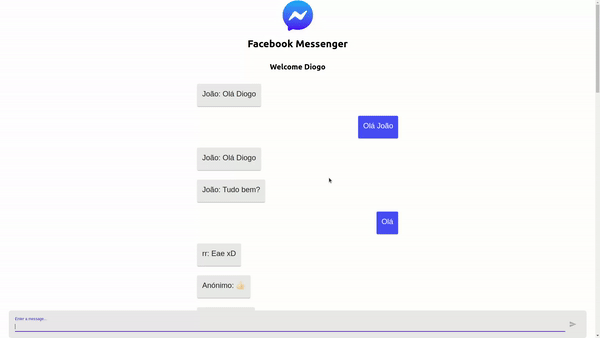

<div align="center">
  

  **Facebook Messenger - App Clone**

  [](https://travis-ci.org/Redocly/redoc) [](https://coveralls.io/github/Redocly/redoc?branch=master) [](https://david-dm.org/Redocly/redoc) [](https://david-dm.org/Redocly/redoc#info=devDependencies)
  
</div>

**This is README for `1.0` version of Facebook Mesenger Clone (React based).**

<h1 align="center">
  
</h1>

<h1 align="center">
  
</h1>

---

## [Live demo](http://redocly.github.io/redoc/)

[](https://facebook-messenger-clone-35b4e.web.app) 

---

## Features v1.0
- Username option
- Live messages sharing

## Roadmap
  - [x] ~~Create app on Firebase~~
  - [x] ~~Start your react app locally~~
  - [x] ~~Add firebase hosting to your app~~
  - [x] ~~Functionality features creation~~
  - [x] ~~Material UI~~
  - [x] ~~Add ability to send message~~
  - [x] ~~Add ability to send message~~
  - [x] ~~Connection firebase with the app~~
  - [x] ~~CSS styling~~
  - [x] ~~Deploying~~

### 1. Clone repository
Install using [npm](https://docs.npmjs.com/getting-started/what-is-npm):

    git clone https://github.com/Xavi002/messenger-clone.git

or using [yarn](https://yarnpkg.com):

    yarn add redoc

### 2. Opoen project folder
```
cd messenger-clone
```

```
code .
```

### 3. Install dependencies
Install using [npm](https://docs.npmjs.com/getting-started/what-is-npm):
```html
npm i
```
or using [yarn](https://yarnpkg.com):

```html
yarn add 
```

### 4. Start project
Install using [npm](https://docs.npmjs.com/getting-started/what-is-npm):
```html
npm start
```
or using [yarn](https://yarnpkg.com):

```html
yarn start
```

### 5. Enjoy :smile:


